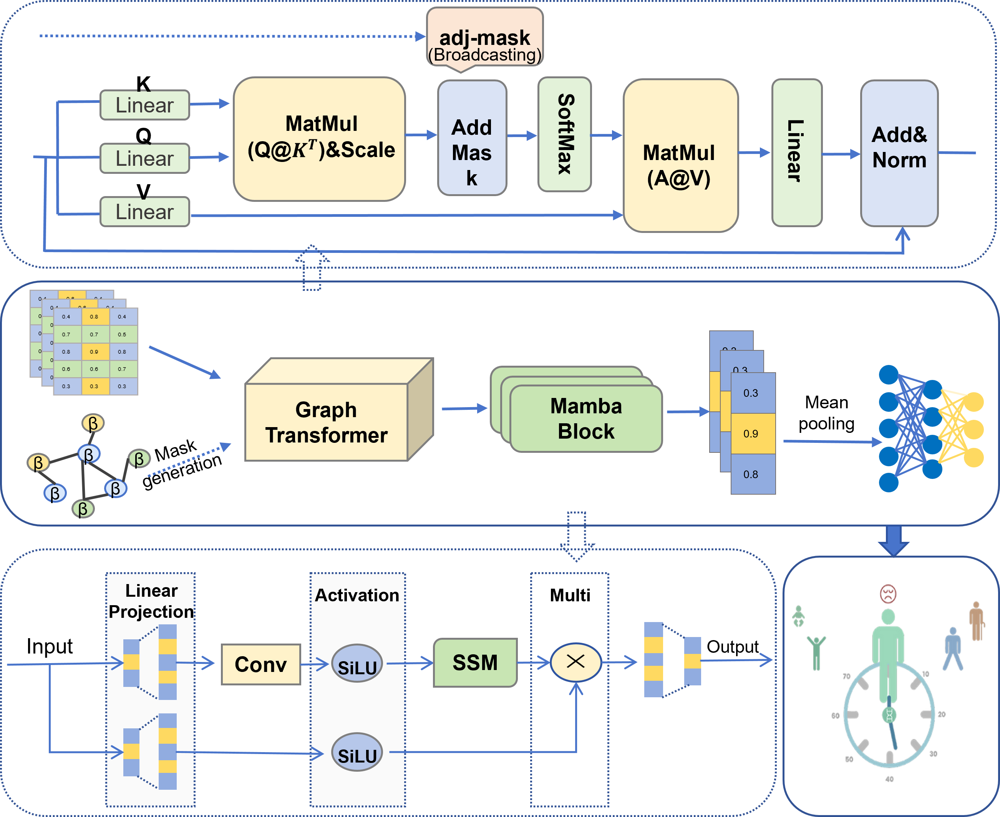

# GT-Mamba: A Topology-Aware Graph-State Space Model for Robust and Interpretable Epigenetic Age Prediction

[](https://opensource.org/licenses/MIT)
[](https://pytorch.org/)
[](https://www.python.org/downloads/)

This repository contains the official implementation of the paper:  
**GT-Mamba: A Topology-Aware Graph-State Space Model for Robust and Interpretable Epigenetic Age Prediction** *(Under Review)*

> **Abstract:** We propose **GT-Mamba**, a novel architecture that integrates a **Structure-Aware Graph Transformer** with the **Mamba** state space model. By explicitly modeling CpG topological correlations and genome-wide long-range dependencies, GT-Mamba achieves state-of-the-art precision and superior robustness across heterogeneous cohorts, effectively addressing the cross-platform (450K vs. 850K) generalizability challenge.


*(Figure 1: Overview of the GT-Mamba Architecture.)*

---

## 📂 Directory Structure

Our codebase is modularized to reflect the core stages of our methodology:

```text
GT-Mamba/
├── checkpoints/          # Pre-trained model weights
│   └── best_model.pth    # ✅ Official pre-trained model
├── configs/              # Global configurations (hyper-parameters, seeds)
├── data/                 # Core datasets and feature lists
│   ├── feature_list_198.csv        # 198-CpG core index & topology refs
│   └── methylation_matrix_198.csv  # ⚡ Ready-to-use matrix for quick demo
├── feature_selection/    # Phase 1: The MARE strategy (scripts 01-06)
├── graph_modeling/       # Phase 2: Spatial Topology construction (K=5)
├── models/               # Phase 3: GT-Mamba PyTorch architecture
├── results/sota/         # Output logs, metrics, and AgeAccel reports
├── utils/                # Reproducibility, Metrics, and Logger modules
├── demo_inference.py     # ⚡ Quick inference for reviewers (10s execution)
├── run_benchmark.py      # 🏆 Full cohort evaluation (GEO reproduction)
├── train.py              # 🔥 End-to-end training script
├── README.md             
└── requirements.txt      
```

---

## 🛠️ Installation

Our implementation utilizes **mambapy** (a pure PyTorch implementation of Mamba), ensuring seamless installation and high compatibility across various systems without complex CUDA compilation.

### 1. Create Environment
```bash
conda create -n gtmamba python=3.10
conda activate gtmamba
```

### 2. Install Dependencies
```bash
# Install PyTorch (matching your CUDA version, e.g., 11.8)
pip install torch==2.0.1 torchvision --index-url [https://download.pytorch.org/whl/cu118](https://download.pytorch.org/whl/cu118)

# Install the rest of the required packages
pip install -r requirements.txt
```

---

## 📁 Data Preparation

This repository includes core mapping files, but due to file size limits, large reference datasets and genomic coordinates are **not included**. Please download and place the missing files in the correct directories before running the pipeline.

### 1. Included Files (Pre-installed)
The following mapping files are already provided in the `data/` directory:
* `204aps.csv`
* `20aps.csv`

### 2. External Downloads Required (Place in `data/references/`)
Please download these 3 files and move them to the `data/references/` folder:

* **`450k_annotation.csv`**: Illumina Official Annotation.
* **`ncbiRefSeq_hg19.csv`**: Genomic Coordinates.
* **`FlowSorted.Blood.450k.csv`**: Blood cell proportion reference.

### 3. Final Directory Structure
After downloading, your `data` folder must look like this:

```text
GT-Mamba/
└── data/
    ├── 204aps.csv          (Already in Repo)
    ├── 20aps.csv           (Already in Repo)
    └── references/
        ├── 450k_annotation.csv      (Download Required)
        ├── FlowSorted.Blood.450k.csv (Download Required)
        └── ncbiRefSeq_hg19.csv       (Download Required)
```
---

## 🚀 Usage

### ⚡ Quick Start (Recommended for Reviewers)
To verify the model's performance instantly using the provided core dataset (`data/methylation_matrix_198.csv`), simply run:

```bash
python demo_inference.py
```
> **Note on Data Integrity:** The provided `methylation_matrix_198.csv` is an independent **Internal Test Set** (N~100) strictly excluded from the training phase. It is provided solely for rapid code verification and demonstration of our Sample-wise Imputation logic without causing Out-of-Memory (OOM) issues.

### 🏆 Full SOTA Benchmark Reproduction
Once the external GEO datasets are placed in the `data/` folder, you can replicate the state-of-the-art results across all 5 cohorts (N=1,892) as presented in our paper:

```bash
python run_benchmark.py
```
*Outputs will be saved in `results/sota/`, including the detailed `benchmark_summary.csv`.*

### 🔥 Model Training
To train GT-Mamba on your own methylation datasets from scratch:

```bash
python train.py
```

---

## 🧬 Core Methodology: Sample-Wise Imputation

To address cross-platform missing probes (e.g., 450K vs. 850K), GT-Mamba employs a robust **Sample-wise Mean Imputation** strategy. Missing CpGs are adaptively filled using the specific sample's global methylation mean:
- **Consistency**: Preserves the individual's global epigenetic baseline.
- **Robustness**: Ensures the model remains functional even with significant probe dropout.
- **Independence**: Decouples inference from large external reference tables.

---

## 📊 Performance Benchmarking

Tested independently across five distinct cohorts (N=1,892), **GT-Mamba significantly outperforms modern deep learning approaches like AltumAge**, achieving the lowest **Weighted Average MAE (4.434 years)**.

| Dataset | Platform | N | GT-Mamba (Ours) | AltumAge | Horvath |
| :--- | :--- | :--- | :--- | :--- | :--- |
| GSE40279 | 450K | 656 | 4.274 | **3.473** | 4.774 |
| GSE61496 | 450K | 310 | **2.762** | 5.869 | 4.300 |
| GSE72777 | 450K | 46  | 2.937 | 4.783 | **2.278** |
| GSE77445 | 450K | 85  | 7.834 | 11.791 | **7.640** |
| GSE132203| 850K | 795 | **4.940** | N/A | 9.955 |
| **Weighted AvgMAE** | - | **1,892** | **4.434** | 4.849* | 6.941 |

*(Note: AltumAge's AvgMAE is calculated excluding GSE132203 due to platform incompatibility. GT-Mamba handles 850K data natively).*

---

## 🔗 Citation

If you find our code or methodology useful, please cite our work:

```bibtex
@article{Wang2026GTMamba,
  title={GT-Mamba: A Topology-Aware Graph-State Space Model for Robust and Interpretable Epigenetic Age Prediction},
  author={Wang, Han and Wang, Hui and Tong, Yanting and Liu, Yuanyuan and Jing, Qu and Zhang, Li},
  journal={Under Review},
  year={2026}
}
```

## 📧 Contact

* **Li Zhang**: [lizhang@ccut.edu.cn](mailto:lizhang@ccut.edu.cn)
* **Han Wang**: [wanghan101@nenu.edu.cn](mailto:wanghan101@nenu.edu.cn)
